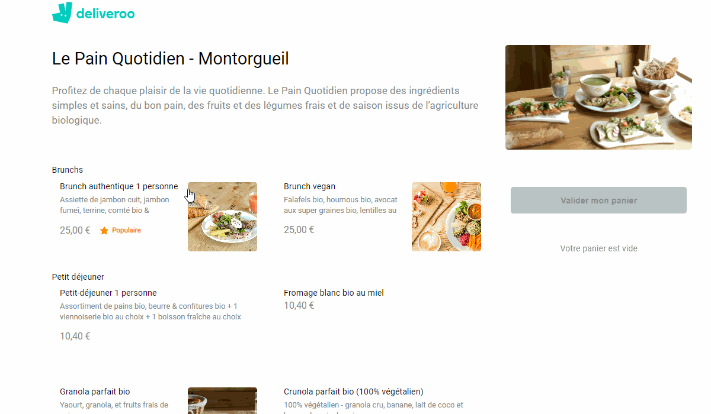

# Deliveroo Menu

This is a replica of the basket page from the deliveroo website.
Its working with an http request to a back end I developed using `axios` package.

## Installation

Just run `yarn` in your console to install all dependencies and `yarn start` to launch.

## Features

- Click on an item to put it in th basket.

- You can click multiple times if you need to purchase more than one item.

- You can add or remove unity of an item already choosen in the basket using plus and minus button.

- The counter goes minimum to 1 if you try to go under it will remove the item from the basket.

## Packages Used

- [axios](https://www.npmjs.com/package/axios)

- [React](https://reactjs.org/)

## Road Map

I will start soon a payment page using Stripe.

## Netlify link

Here you can see and try this project :

https://zmzm-deliveroo.netlify.app/

